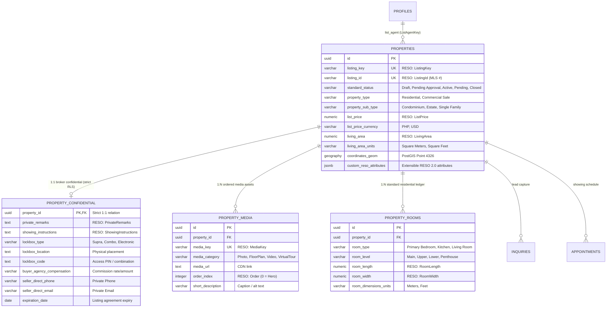

# Architectural Design Specification: RESO 2.0 Property Listings Schema

> **System**: CP_kerby Luxury Architectural Real Estate Platform  
> **Classification**: Production PostgreSQL / Supabase Schema Specification  
> **Standard**: RESO Data Dictionary 2.0 & RESO Web API Standard  
> **Date**: 2026-09-25  
> **Status**: Approved via Technical Interview (/grill-me)  

---

## 1. Executive Summary & Design Decisions

Through technical interrogation and architectural alignment, the property listings database module integrates the latest **RESO Data Dictionary 2.0** standard with modern PostgreSQL best practices.

### Final Architectural Decisions:
1. **Migration Approach**: **In-place non-destructive migration**. We alter `public.properties` to add RESO standard columns, preserving all existing records, and create the new normalized tables (`property_media`, `property_confidential`, `property_rooms`).
2. **Media Strategy**: **Dual-compatibility with backfill**. Existing `images TEXT[]` are backfilled into `public.property_media`, and a database trigger maintains synchronization so current frontend components continue working without disruption.
3. **API Query Architecture**: **Hybrid REST + RESO Query Translator**. Endpoints at `/api/properties` accept friendly query parameters (`city`, `minPrice`, `beds`) as well as standard RESO OData parameters (`$filter`, `$select`, `$expand=media,rooms`).
4. **Replication Scope**: **Direct Entry Only**. Optimized cleanly for direct agent and broker authoring on the CP_kerby platform without external MLS sync metadata overhead.
5. **Architectural Room Detail**: **Standard Residential Ledger**. Supports standard residential spaces (`Primary Bedroom`, `Bedroom`, `Bathroom`, `Living Room`, `Dining Room`, `Kitchen`, `Home Office`) with room levels, dimensions, and features.
6. **Listing Governance & Approval**: **Broker Approval Required**. Agents can save as `Draft` or submit as `Pending Approval`. Transitioning to `Active` is strictly gated to `broker` and `admin` roles via database RLS and trigger enforcement.
7. **Security & Redaction**: **Isolated 1:1 Confidential Table (`property_confidential`)**. Confidential fields (`PrivateRemarks`, lockbox codes, showing instructions, commission splits) are partitioned into a dedicated table with zero-read RLS for clients and anonymous visitors.
8. **Geospatial & Units**: **PostGIS Spatial Geography & Dual Units**. Natively supports `geography(Point, 4326)` with a GiST index alongside `sqm`/`sqft` and `PHP`/`USD`.

---

## 2. Entity-Relationship Diagram



---

## 3. Data Dictionary Schema Specifications

### 3.1 Table: `public.properties` (Enhanced with RESO DD 2.0)

```sql
-- Extensions
CREATE EXTENSION IF NOT EXISTS "uuid-ossp";
CREATE EXTENSION IF NOT EXISTS "postgis";

-- Alter existing table non-destructively / create fresh
ALTER TABLE public.properties
  ADD COLUMN IF NOT EXISTS listing_key VARCHAR(64) UNIQUE,
  ADD COLUMN IF NOT EXISTS listing_id VARCHAR(32) UNIQUE,
  ADD COLUMN IF NOT EXISTS standard_status VARCHAR(32) NOT NULL DEFAULT 'Draft',
  ADD COLUMN IF NOT EXISTS property_sub_type VARCHAR(64),
  ADD COLUMN IF NOT EXISTS list_price_currency VARCHAR(3) DEFAULT 'PHP',
  ADD COLUMN IF NOT EXISTS original_list_price NUMERIC(15, 2),
  ADD COLUMN IF NOT EXISTS association_fee NUMERIC(12, 2) DEFAULT 0.00,
  ADD COLUMN IF NOT EXISTS association_fee_frequency VARCHAR(20) DEFAULT 'Monthly',
  ADD COLUMN IF NOT EXISTS tax_annual_amount NUMERIC(12, 2),
  ADD COLUMN IF NOT EXISTS living_area NUMERIC(10, 2),
  ADD COLUMN IF NOT EXISTS living_area_units VARCHAR(20) DEFAULT 'Square Meters',
  ADD COLUMN IF NOT EXISTS lot_size_area NUMERIC(12, 2),
  ADD COLUMN IF NOT EXISTS lot_size_units VARCHAR(20) DEFAULT 'Square Meters',
  ADD COLUMN IF NOT EXISTS bedrooms_total SMALLINT DEFAULT 1,
  ADD COLUMN IF NOT EXISTS bathrooms_total_integer SMALLINT DEFAULT 1,
  ADD COLUMN IF NOT EXISTS bathrooms_full SMALLINT DEFAULT 1,
  ADD COLUMN IF NOT EXISTS bathrooms_half SMALLINT DEFAULT 0,
  ADD COLUMN IF NOT EXISTS stories_total SMALLINT DEFAULT 1,
  ADD COLUMN IF NOT EXISTS interior_features TEXT[] DEFAULT '{}',
  ADD COLUMN IF NOT EXISTS exterior_features TEXT[] DEFAULT '{}',
  ADD COLUMN IF NOT EXISTS parking_total SMALLINT DEFAULT 0,
  ADD COLUMN IF NOT EXISTS unparsed_address TEXT,
  ADD COLUMN IF NOT EXISTS subdivision_name VARCHAR(128),
  ADD COLUMN IF NOT EXISTS state_or_province VARCHAR(64),
  ADD COLUMN IF NOT EXISTS postal_code VARCHAR(20),
  ADD COLUMN IF NOT EXISTS public_remarks TEXT,
  ADD COLUMN IF NOT EXISTS custom_reso_attributes JSONB DEFAULT '{}'::jsonb,
  ADD COLUMN IF NOT EXISTS list_agent_key UUID REFERENCES public.profiles(id);

-- Check constraints for valid RESO statuses and currency
ALTER TABLE public.properties DROP CONSTRAINT IF EXISTS chk_properties_standard_status;
ALTER TABLE public.properties ADD CONSTRAINT chk_properties_standard_status 
  CHECK (standard_status IN ('Draft', 'Pending Approval', 'Active', 'Active Under Contract', 'Pending', 'Closed', 'Canceled', 'Expired'));

ALTER TABLE public.properties DROP CONSTRAINT IF EXISTS chk_properties_currency;
ALTER TABLE public.properties ADD CONSTRAINT chk_properties_currency 
  CHECK (list_price_currency IN ('PHP', 'USD', 'EUR', 'GBP', 'SGD', 'JPY'));
```

### 3.2 PostGIS Spatial Coordinates

```sql
-- Generated geography column for high-speed spatial boundary and radius search
ALTER TABLE public.properties
  ADD COLUMN IF NOT EXISTS coordinates_geom GEOGRAPHY(Point, 4326)
  GENERATED ALWAYS AS (
    CASE 
      WHEN latitude IS NOT NULL AND longitude IS NOT NULL 
      THEN ST_SetSRID(ST_MakePoint(longitude, latitude), 4326)::geography 
      ELSE NULL 
    END
  ) STORED;

CREATE INDEX IF NOT EXISTS idx_properties_coordinates_geom 
  ON public.properties USING GIST (coordinates_geom);
```

### 3.3 Table: `public.property_confidential` (Broker-Only Isolation)

```sql
CREATE TABLE IF NOT EXISTS public.property_confidential (
  property_id UUID PRIMARY KEY REFERENCES public.properties(id) ON DELETE CASCADE,
  private_remarks TEXT,
  showing_instructions TEXT,
  lockbox_type VARCHAR(64),
  lockbox_location TEXT,
  lockbox_code TEXT,
  buyer_agency_compensation VARCHAR(64),
  seller_direct_phone VARCHAR(32),
  seller_direct_email VARCHAR(128),
  expiration_date DATE,
  created_at TIMESTAMPTZ NOT NULL DEFAULT timezone('utc'::text, now()),
  updated_at TIMESTAMPTZ NOT NULL DEFAULT timezone('utc'::text, now())
);

ALTER TABLE public.property_confidential ENABLE ROW LEVEL SECURITY;

-- Zero access for anonymous visitors and public clients
DROP POLICY IF EXISTS "Deny all public access to confidential property data" ON public.property_confidential;
CREATE POLICY "Deny all public access to confidential property data"
  ON public.property_confidential FOR SELECT
  TO anon, authenticated
  USING (
    EXISTS (
      SELECT 1 FROM public.profiles 
      WHERE id = auth.uid() AND role IN ('agent', 'broker', 'admin')
    )
  );

DROP POLICY IF EXISTS "Agents and brokers can modify confidential property data" ON public.property_confidential;
CREATE POLICY "Agents and brokers can modify confidential property data"
  ON public.property_confidential FOR ALL
  TO authenticated
  USING (
    EXISTS (
      SELECT 1 FROM public.profiles 
      WHERE id = auth.uid() AND role IN ('agent', 'broker', 'admin')
    )
  );
```

### 3.4 Table: `public.property_media` (RESO Media Assets)

```sql
CREATE TABLE IF NOT EXISTS public.property_media (
  id UUID DEFAULT gen_random_uuid() PRIMARY KEY,
  property_id UUID NOT NULL REFERENCES public.properties(id) ON DELETE CASCADE,
  media_key VARCHAR(64) UNIQUE NOT NULL DEFAULT ('MED-' || gen_random_uuid()),
  media_url TEXT NOT NULL,
  media_category VARCHAR(32) NOT NULL DEFAULT 'Photo' 
    CHECK (media_category IN ('Photo', 'FloorPlan', 'Video', 'VirtualTour', 'Document')),
  order_index INTEGER NOT NULL DEFAULT 0,
  short_description VARCHAR(255),
  mime_type VARCHAR(64) DEFAULT 'image/jpeg',
  created_at TIMESTAMPTZ NOT NULL DEFAULT timezone('utc'::text, now())
);

CREATE INDEX IF NOT EXISTS idx_property_media_lookup 
  ON public.property_media(property_id, order_index ASC);

ALTER TABLE public.property_media ENABLE ROW LEVEL SECURITY;

CREATE POLICY "Media is viewable by everyone."
  ON public.property_media FOR SELECT
  USING (true);

CREATE POLICY "Agents, brokers, and admins can manage media."
  ON public.property_media FOR ALL
  TO authenticated
  USING (
    EXISTS (
      SELECT 1 FROM public.profiles 
      WHERE id = auth.uid() AND role IN ('agent', 'broker', 'admin')
    )
  );
```

### 3.5 Table: `public.property_rooms` (Standard Residential Ledger)

```sql
CREATE TABLE IF NOT EXISTS public.property_rooms (
  id UUID DEFAULT gen_random_uuid() PRIMARY KEY,
  property_id UUID NOT NULL REFERENCES public.properties(id) ON DELETE CASCADE,
  room_type VARCHAR(64) NOT NULL 
    CHECK (room_type IN ('Primary Bedroom', 'Bedroom', 'Bathroom', 'Living Room', 'Dining Room', 'Kitchen', 'Home Office', 'Balcony', 'Laundry')),
  room_level VARCHAR(32) DEFAULT 'Main'
    CHECK (room_level IN ('Main', 'Second', 'Third', 'Basement', 'Penthouse', 'Upper', 'Lower')),
  room_length NUMERIC(6, 2),
  room_width NUMERIC(6, 2),
  room_dimensions_units VARCHAR(16) DEFAULT 'Meters'
    CHECK (room_dimensions_units IN ('Meters', 'Feet')),
  room_features TEXT[] DEFAULT '{}',
  created_at TIMESTAMPTZ NOT NULL DEFAULT timezone('utc'::text, now())
);

CREATE INDEX IF NOT EXISTS idx_property_rooms_property_id 
  ON public.property_rooms(property_id);

ALTER TABLE public.property_rooms ENABLE ROW LEVEL SECURITY;

CREATE POLICY "Rooms are viewable by everyone."
  ON public.property_rooms FOR SELECT
  USING (true);

CREATE POLICY "Agents, brokers, and admins can manage rooms."
  ON public.property_rooms FOR ALL
  TO authenticated
  USING (
    EXISTS (
      SELECT 1 FROM public.profiles 
      WHERE id = auth.uid() AND role IN ('agent', 'broker', 'admin')
    )
  );
```

---

## 4. Governance & Status Transition Rules

To enforce the **Broker Approval Required** business rule:
1. **Agents**: Can create and update properties with `standard_status IN ('Draft', 'Pending Approval')`.
2. **Brokers / Admins**: Only users whose profile `role IN ('broker', 'admin')` can update `standard_status` to `'Active'`, `'Closed'`, or `'Canceled'`.

```sql
CREATE OR REPLACE FUNCTION public.enforce_property_status_lifecycle()
RETURNS TRIGGER AS $$
DECLARE
  user_role TEXT;
BEGIN
  -- Determine role of acting user
  SELECT role INTO user_role FROM public.profiles WHERE id = auth.uid();

  -- If transitioning to 'Active' from any other status, require broker or admin role
  IF NEW.standard_status = 'Active' AND (OLD.standard_status IS DISTINCT FROM 'Active') THEN
    IF user_role NOT IN ('broker', 'admin') THEN
      RAISE EXCEPTION 'Only brokers and administrators can approve and activate property listings.';
    END IF;
  END IF;

  RETURN NEW;
END;
$$ LANGUAGE plpgsql SECURITY DEFINER;

DROP TRIGGER IF EXISTS trg_enforce_property_status ON public.properties;
CREATE TRIGGER trg_enforce_property_status
  BEFORE UPDATE OF standard_status ON public.properties
  FOR EACH ROW EXECUTE FUNCTION public.enforce_property_status_lifecycle();
```

---

## 5. Performance Indexing Blueprint

```sql
-- Client faceted search composite index
CREATE INDEX IF NOT EXISTS idx_properties_client_search 
  ON public.properties(standard_status, city, price, property_type);

-- Full text search GIN index
CREATE INDEX IF NOT EXISTS idx_properties_fts ON public.properties USING GIN (
  to_tsvector('english', 
    coalesce(title, '') || ' ' || 
    coalesce(unparsed_address, '') || ' ' || 
    coalesce(city, '') || ' ' || 
    coalesce(subdivision_name, '') || ' ' || 
    coalesce(public_remarks, '')
  )
);

-- JSONB GIN index for custom/extensible attributes
CREATE INDEX IF NOT EXISTS idx_properties_custom_reso 
  ON public.properties USING GIN (custom_reso_attributes);
```

---

## 6. Verification & Implementation Plan

1. **Step 1**: Write the executable migration file `backend/src/models/reso_schema_migration.sql`.
2. **Step 2**: Update shared TypeScript contract definitions in `shared/types/property.ts`.
3. **Step 3**: Update backend model `backend/src/models/property.model.ts` to reflect the RESO attributes and relationships.
4. **Step 4**: Test execution against sample data fixtures and verify RLS confidentiality boundaries.
